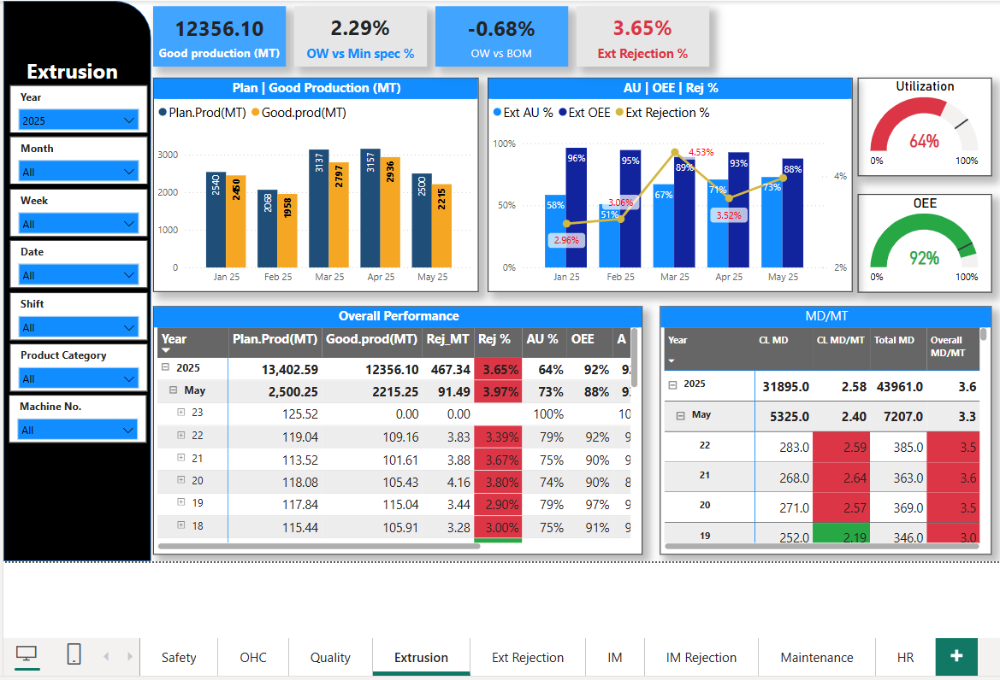

# Power BI Manufacturing Dashboard
A power BI dashboard for monitoring manufacturing KPIs, built during my internship at Ashirvad by Aliaxis. Screenshots provided for demonstration

# Manufacturing Operations Dashboard – Power BI Project

This project showcases a simulated version of a Power BI dashboard I created during my internship at a leading manufacturing company. The dashboard was built to enhance visibility of plant-wide performance metrics, helping the Operational Excellence team monitor key KPIs across departments such as **Production, Maintenance, Safety, Quality, and HR**.

 **Disclaimer**: Due to confidentiality agreements, only screenshots are provided. Actual data and .pbix files are not shared.

## Project Summary

The dashboard enables leadership to make data-driven decisions by providing insights into:

- Department-wise incident tracking 
- Machine-wise production and rejection analysis (Extrusion & Injection Molding)
- Shift and date-wise downtime analysis
- Manpower utilization per metric ton produced
- Energy consumption and maintenance breakdowns
- Complaint types and rejection categories

## Key Features

- Real-time KPI tracking with card visuals
- Trend charts for productivity, rejection, and downtime
- Machine and shift performance benchmarking
- Department-wise safety incident reporting
- Drill-down into rejection causes by product line and machine

## Tools & Techniques

- **Power BI Desktop** for visualization
- **Power Query** for data transformation and cleaning
- **DAX** for calculated fields (e.g., Rejection %, OEE, AU%)
- **Slicers** for filtering by department, shift, product, and time
- **Page navigation** for multi-section dashboard

## KPI & Metric Descriptions

Here are some of the key metrics used in the dashboard:

- **OEE (Overall Equipment Effectiveness)**: Measures the efficiency of manufacturing equipment. It's calculated using Availability × Performance × Quality.

- **AU% (Available Utilization)**: Represents the percentage of time equipment is available for production compared to scheduled time.

- **Rejection %**: Percentage of defective products compared to total production.

- **MD/MT (Man-days per Metric Ton)**: Manpower efficiency — how many man-days were required to produce 1 MT of product.

- **Near Miss**: An unplanned event that could have resulted in an accident, injury, or damage.

- **HMS (Hazard Management System)**: Tracks safety hazards identified and resolved.

- **Complaint Type**: Categorization of customer or internal complaints (e.g., Visual Not OK, Impact Test Fail).

- **Downtime Reasons**: Categories of equipment downtime (e.g., Screw Cooling issue, Feeder problem, Mold maintenance).

- **Energy Consumption (KWH/Kg)**: Measures energy used per kilogram of output — used to monitor efficiency.

## Sample Screenshots (Blurred)

| Safety | OHC | Quality | Extrusion | Extrusion_rejection_Analysis | IM | IM_Rejection_Analysis | Maintenance | Manpower |
|--------|-----|---------|-----------|------------------------------|----|-----------------------|-------------|----------|
|  |  |  |   |  |  |  |  |  |

## Outcomes

- Provided a centralized visibility tool for key production KPIs
- Reduced manual reporting effort across shifts and departments
- Enabled better planning by tracking AU%, OEE, and rejection rates
- Supported root cause analysis for frequent quality issues

## About Me

**Chandra Kishor Mandal**  
Aspiring Data Analyst | Skilled in Power BI, SQL, Excel  
[LinkedIn](https://www.linkedin.com/in/chandrakishor06)

## Legal Note

This dashboard was built during my internship at **Ashirvad by Aliaxis** as part of the Operational Excellence team. All sensitive data has been excluded. The `.pbix` file is not shared publicly to honor confidentiality.

